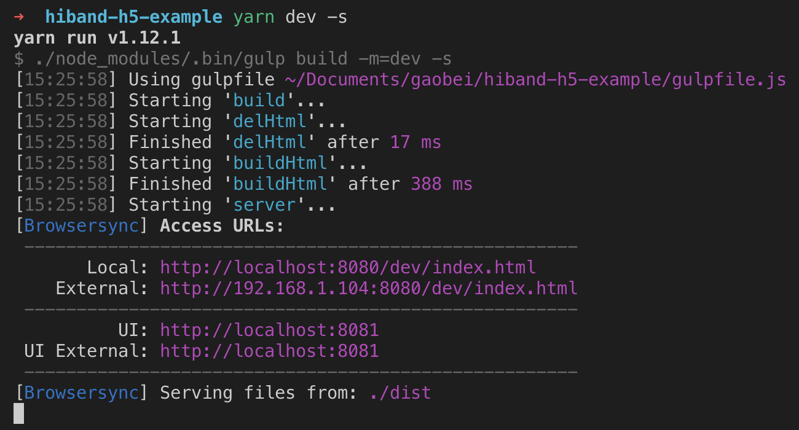

# hiband-h5页面模板

## 开发环境

模板用的数据是`config/data.js`里面的`data.dev`

```
yarn dev
```

## 打包测试站

模板用的数据是`config/data.js`里面的`data.test`

```
yarn build:test
```

## 打包正式站

模板用的数据是`config/data.js`里面的`data.prod`

```
yarn build:prod
```

## 启动静态资源服务

**mode**: 分别为dev|test|prod，分别对应开发环境|测试站|正式站

```
yarn server:[mode]
```

## 发布到服务器

> TODO: 上传接口有问题

```
yarn publish:[mode]
```

## 目录结构

```
.
├── README.md
├── config
│   ├── config.js
│   ├── data.js
│   ├── publish.js
│   └── url.js
├── dist
│   ├── dev
│   │   ├── index.html
│   │   └── info.html
│   ├── prod
│   │   ├── index.html
│   │   └── info.html
│   └── test
│       ├── index.html
│       └── info.html
├── gulpfile.js
├── package.json
├── postcss.config.js
├── screenshots
│   ├── yarn-build-prod.png
│   ├── yarn-build-test.png
│   └── yarn-dev.png
├── src
│   ├── assets
│   │   ├── �\212�\227��\216��\215\2201.png
│   │   ├── �\234\200�\217\227欢�\2161.png
│   │   ├── �\212�\227��\216��\215\2201@2x.png
│   │   ├── �\234\200�\217\227欢�\2161@2x.png
│   │   ├── �\212�\227��\216��\215\2201@3x.png
│   │   ├── �\234\200�\217\227欢�\2161@3x.png
│   │   ├── �\212�\227��\216��\215\2202.png
│   │   ├── �\234\200�\217\227欢�\2162.png
│   │   ├── �\212�\227��\216��\215\2202@2x.png
│   │   ├── �\234\200�\217\227欢�\2162@2x.png
│   │   ├── �\212�\227��\216��\215\2202@3x.png
│   │   ├── �\234\200�\217\227欢�\2162@3x.png
│   │   ├── �\212�\227��\216��\215\2203.png
│   │   ├── �\234\200�\217\227欢�\2163.png
│   │   ├── �\212�\227��\216��\215\2203@2x.png
│   │   ├── �\234\200�\217\227欢�\2163@2x.png
│   │   ├── �\212�\227��\216��\215\2203@3x.png
│   │   ├── �\234\200�\217\227欢�\2163@3x.png
│   │   ├── �\212�\227��\216��\215\2204.png
│   │   ├── �\234\200�\217\227欢�\2164.png
│   │   ├── �\212�\227��\216��\215\2204@2x.png
│   │   ├── �\234\200�\217\227欢�\2164@2x.png
│   │   ├── �\212�\227��\216��\215\2204@3x.png
│   │   ├── �\234\200�\217\227欢�\2164@3x.png
│   │   ├── �\212�\227��\216��\215\2205.png
│   │   ├── �\234\200�\217\227欢�\2165.png
│   │   ├── �\212�\227��\216��\215\2205@2x.png
│   │   ├── �\234\200�\217\227欢�\2165@2x.png
│   │   ├── �\212�\227��\216��\215\2205@3x.png
│   │   ├── �\234\200�\217\227欢�\2165@3x.png
│   │   ├── �\212�\227��\216��\215\2206.png
│   │   ├── �\234\200�\217\227欢�\2166.png
│   │   ├── �\212�\227��\216��\215\2206@2x.png
│   │   ├── �\234\200�\217\227欢�\2166@2x.png
│   │   ├── �\212�\227��\216��\215\2206@3x.png
│   │   ├── �\234\200�\217\227欢�\2166@3x.png
│   │   ├── �\212�\227��\216��\215\2207.png
│   │   ├── �\234\200�\217\227欢�\2167.png
│   │   ├── �\212�\227��\216��\215\2207@2x.png
│   │   ├── �\234\200�\217\227欢�\2167@2x.png
│   │   ├── �\212�\227��\216��\215\2207@3x.png
│   │   └── �\234\200�\217\227欢�\2167@3x.png
│   ├── index.html
│   └── info.html
├── test
│   ├── account.test.js
│   └── pup.test.js
├── tree.txt
├── utils
│   ├── account.js
│   ├── api.js
│   ├── cookie.js
│   ├── file.js
│   ├── index.js
│   └── yargs.js
└── yarn.lock
```

## 截图

### 开发环境启动


### 测试站打包


### 正式站打包
